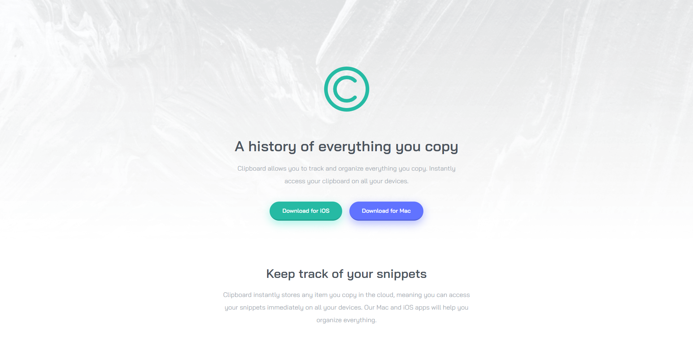

<div align="center">
  
</div>
<h1 align="center">
  Clipboard Landing Page
</h1>
<p align="center">
    O website que promove um app capaz de rastrear e armazenar no iCloud, quaisquer dados copiados pelo usuário. Feito especialmente para o desafio do Frontend Mentor e hospedado no GitHub-Pages <a href="https://jonathanbenedito.github.io/clipboard-landing-page/" target="_blank">jonathanbenedito.github.io/clipboard-landing-page/</a>
</p>




## 🛠 Guia de instalação

1. Faça o clone do projeto
    ```
    git clone https://github.com/jonathanBenedito/clipboard-landing-page.git
    ```

2. Acesse o repositório
    ```
    cd clipboard-landing-page
    ```

## 💬 Sobre o projeto

### O desafio

A proposta é construir uma landing page completa que seja capaz de visualizar layouts otimizados para diferentes tamanhos de telas dos dispositivos. Todos os elementos interativos deverão conter um estado hover, e o projeto deverá ser feito utilizando HTML e CSS.

### Fotos (Mobile)

|   |  |
|:---:|:---:|
| Smartphone layout | Tablet layout |

### Links

Website: <a href="https://jonathanbenedito.github.io/clipboard-landing-page/">jonathanbenedito.github.io/clipboard-landing-page/</a><br />
Desafio do Frontend Mentor: <a href="https://www.frontendmentor.io/challenges/clipboard-landing-page-5cc9bccd6c4c91111378ecb9">frontendmentor.io/challenges/clipboard-landing-page-5cc9bccd6c4c91111378ecb9</a>

### Tecnologias

O website foi construído usando apenas HTML5 e CSS3.

<div style="display: flex; margin-top: 15px; gap: 20px;">
  
  
</div>